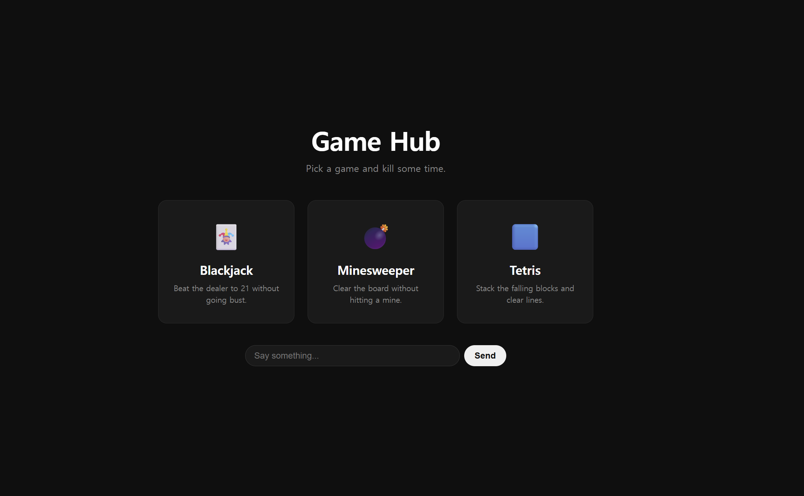
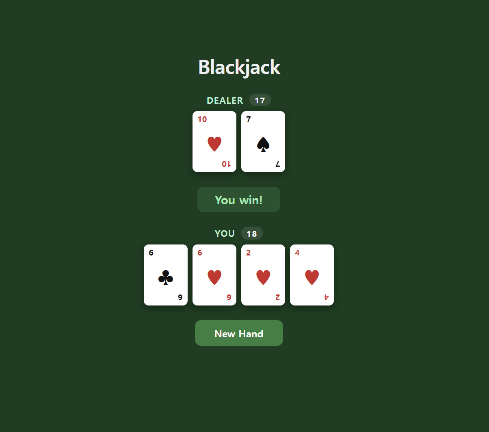
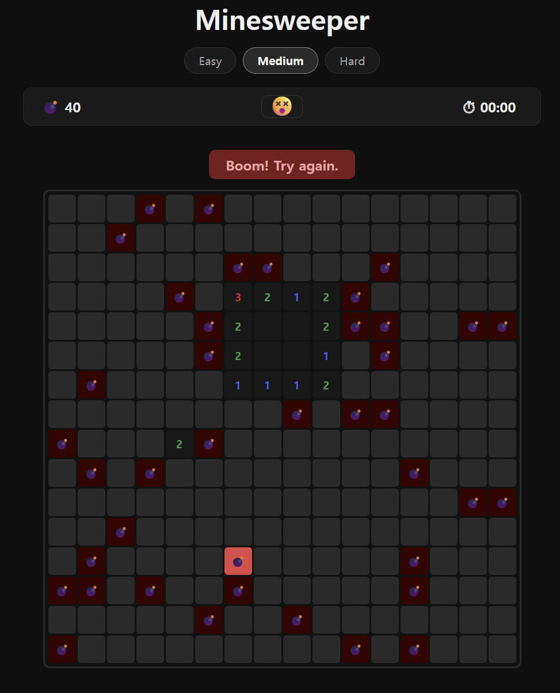
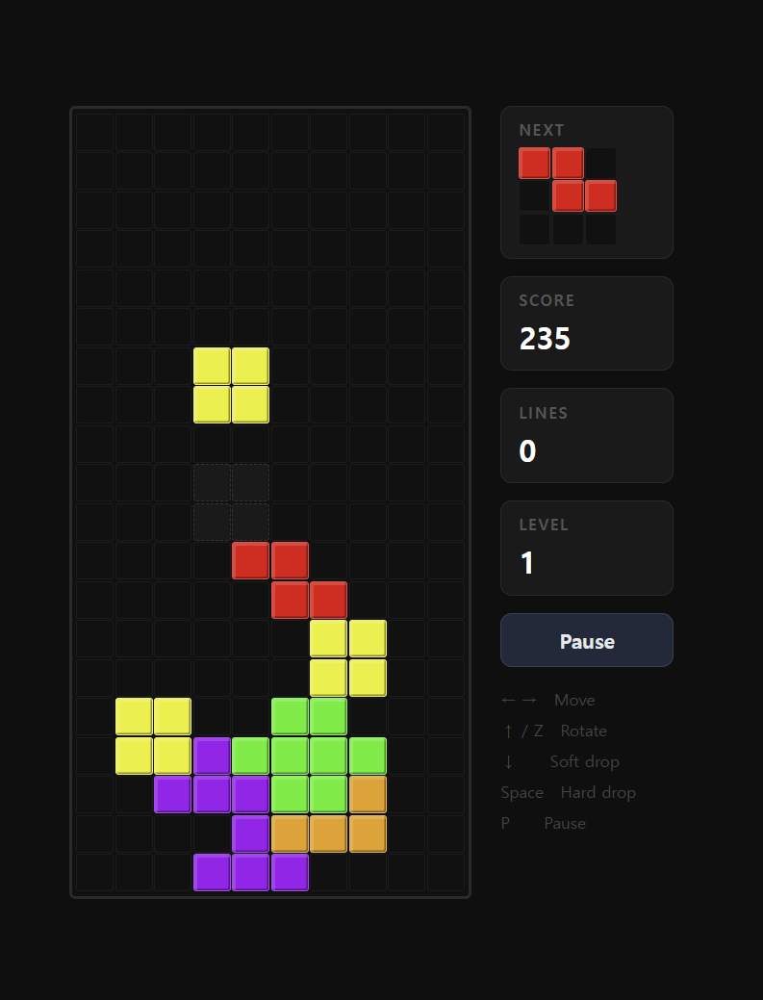

# Game Hub

> A browser-based arcade collection — Blackjack, Minesweeper, and Tetris in one place. No login. Just play.


---

## Visual Demonstration

| Home | Blackjack | Minesweeper | Tetris |
|------|-----------|-------------|--------|
|  |  |  |  |

> **Live docs:** [GitHub Pages — Sphinx API Reference](https://suder0213.github.io/open-source-programming/)

---

## Motivation and Problem

Starting from a single Flask `app.py` with no structure, this project was rebuilt to explore what good software architecture looks like in practice.

The original codebase had several issues that made it difficult to extend:

- A single file owned every responsibility — routing, business logic, and configuration all mixed together
- Adding a new game meant editing existing code, with no clear boundaries between features
- Frontend components made raw API calls inline with game logic, with no separation

The goal was to go beyond "it works" and build something that is also **readable, testable, and easy to extend**.

---

## Tech Stack & Rationale

| Layer | Technology | Why |
|---|---|---|
| Backend | **FastAPI** | Automatic Swagger UI, native type hints, async-ready — a modern upgrade from Flask |
| Frontend | **React + Vite** | Component model isolates game logic per page; Vite's dev server makes iteration fast |
| Styling | **Plain CSS** | Games have unique layouts — a utility framework would add complexity without benefit |
| Containerisation | **Docker + Compose** | Single command to run the full stack regardless of host environment |
| API Contract | **REST / JSON** | Stateless and simple; no session management needed |
| Documentation | **Sphinx + furo** | Generates structured HTML docs from docstrings; deployed to GitHub Pages |
| Testing | **pytest + httpx** | Service-layer logic tested in isolation, without an HTTP server |

---

## Key Features

**Blackjack**
- Full card game against a computer dealer
- Deck shuffled server-side (`GET /api/blackjack/new-deck`); game logic runs client-side
- Handles natural blackjack, bust, and push outcomes
- Graceful fallback to a client-side deck if the backend is unreachable

**Minesweeper**
- Three difficulty levels: Easy (9×9), Medium (16×16), Hard (16×30)
- Mine positions generated server-side (`POST /api/minesweeper/new-game`)
- Guaranteed safe zone — the 3×3 area around the first click is always mine-free
- Flood-fill reveal for zero-neighbor cells; flag with right-click; live timer

**Tetris**
- All 7 standard tetrominoes with clockwise rotation and 5-offset wall kicks
- Ghost piece shows landing position; soft drop and hard drop supported
- Score table follows Nintendo scoring (100 / 300 / 500 / 800 × level)
- Speed increases every 10 lines; pause overlay rendered inside the board

---

## Getting Started

### Option A — Docker (recommended)

**Requirements:** [Docker Desktop](https://www.docker.com/products/docker-desktop/)

```bash
git clone https://github.com/suder0213/open-source-programming.git
cd open-source-programming/gamehub

docker compose up --build
```

Open **http://localhost:5173** in your browser.

```bash
# Stop
docker compose down
```

---

### Option B — Manual

**Requirements:** Python 3.10+, Node.js 18+

**1. Backend**

```bash
cd backend
pip install -r requirements.txt
uvicorn main:app --reload
# API running at http://localhost:8000
# Swagger UI at http://localhost:8000/docs
```

**2. Frontend** (new terminal)

```bash
cd frontend
npm install
npm run dev
# App running at http://localhost:5173
```

---

### Running Tests

```bash
cd backend
pytest tests/ -v
```

---

## Project Structure

```
gamehub/
├── backend/
│   ├── main.py              # App entry point — router registration only
│   ├── routers/             # HTTP layer (request parsing, response formatting)
│   │   ├── blackjack.py
│   │   ├── minesweeper.py
│   │   └── echo.py
│   ├── services/            # Business logic (no FastAPI dependency)
│   │   ├── blackjack.py     # Deck generation
│   │   └── minesweeper.py   # Mine placement
│   ├── tests/
│   └── requirements.txt
├── frontend/
│   └── src/
│       ├── api/
│       │   └── gameApi.js   # Centralised fetch calls + local fallbacks
│       └── pages/
│           ├── Home.jsx
│           ├── Blackjack.jsx
│           ├── Minesweeper.jsx
│           └── Tetris.jsx
├── docs/                    # Sphinx documentation root
│   ├── conf.py
│   ├── api/                 # Auto-generated from docstrings
│   └── project/             # Architecture notes, refactoring log
└── docker-compose.yml
```

---

## API Reference

| Method | Path | Description |
|---|---|---|
| `GET` | `/` | Health check |
| `GET` | `/api/blackjack/new-deck` | Shuffled 52-card deck |
| `POST` | `/api/minesweeper/new-game` | Board dimensions + mine positions |
| `POST` | `/api/echo` | Echo text with random position |

Interactive documentation available at **http://localhost:8000/docs** (Swagger UI) when the backend is running.

---

## Lessons Learned & Challenges

**Identifying and fixing code smells**
The initial backend was a single file where all concerns lived together. Through deliberate code smell analysis — God File, Comment-as-Structure, Missing Service Layer, Closed to Extension — the backend was refactored in three phases without changing any external behaviour. Every refactoring step was verified by running the existing test suite before moving on.

**Separating routing from business logic**
The biggest architectural shift was introducing a service layer. Route handlers previously contained game logic directly; after the refactor, handlers only parse requests and delegate to pure functions in `services/`. This made the logic independently testable and easier to reason about.

**Frontend API coupling**
Each game component originally made raw `fetch` calls inline. Centralising these into `api/gameApi.js` removed duplication and separated the concern of "how to reach the backend" from "how to play the game." It also gave a single place to add fallback logic when the backend is unreachable.

**Sphinx and GitHub Pages**
Setting up Sphinx required understanding how autodoc imports modules at build time — FastAPI and Pydantic had to be mocked since they are not installed in the documentation build environment. The first GitHub Pages deployment rendered without styles because Jekyll silently ignores `_static/` folders; adding a `.nojekyll` file resolved this.

**Real-time game loop in React**
Tetris required managing a game loop with `setInterval` inside React's state model. Stale closure issues were avoided by using `useReducer`, which processes every action against the latest state snapshot rather than a captured closure value.
